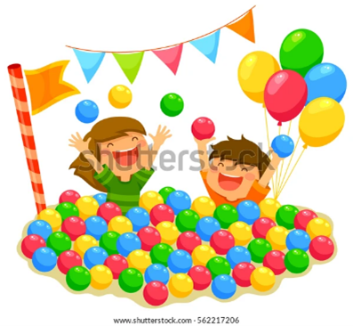
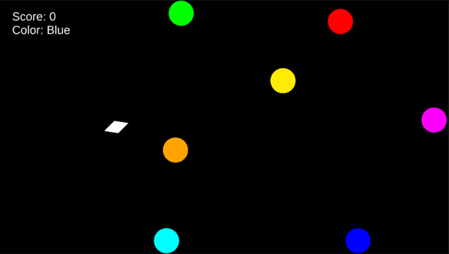

# Tasks and Distractions 2D #

## About the Game ##
This game allows you to shoot projectiles at specific-colored objects to obtain points. This game is partly inspired by colors on the electromagnetic spectrum and photons reaching specific energy levels. Though, it’s mostly inspired by bouncing balls and pushing your way through ball pits. Enjoy!

This game was made with Unity version 2020.3.18f1.

## Objects ##

* Player: You are the white diamond. You can shoot objects out of the right end of the diamond as presented at the beginning of the game. It is intended that you may lose orientation of which side shoots projectiles as the game progresses.
* ColoredLight: At the beginning of the game, seven (7) different circles will spawn on the screen, each with different colors. The possible game colors are Red, Orange, Yellow, Green, Blue, Magenta, Cyan. These objects will spawn with a specific velocity and should lose minimal momentum when hitting other objects.
* Photon: These are the projectiles the player can shoot. Photons are small white orbs that are the same material as ColoredLight. When these photons hit a ColoredLight object, these photons immediately turn into a ColoredLight object of the same color.
* Walls: The game is bounded by four immovable walls along the edges that allow objects to bounce off them.

## Controls ##
An executable Photons2D.exe can be found in the most recent Build folder. The entire Build folder will be necessary to run the game, though you can also re-build the game from Unity itself.

This game was developed using a controller.

* Move Player Left or Right – Horizontal Axis			[Default: X axis]
* Move Player Up or Down – Vertical Axis				[Default: Y axis]
* Rotate Clockwise or Counterclockwise – Rotate Axis 		[Default: 6th axis]
* Shoot a Photon – Fire Button					[Default: Joystick Button 7]
* Quit – Cancel Button or Escape Key				[Default: Joystick Button 9]

If playing with Unity player, start the game by playing the Main Level Scene. Remember to set to Full HD. 

## Rules ##
* To score (1) point, you must fire a photon at a ColoredLight of the same color as the text displayed at the top left side of the screen, under the score.

* If a photon hits a ColoredLight of a different color, you score (-1) point.

* The goal color will randomly update to a new color (or has a 1/7 chance to keep the same color) every 10 seconds by default.*

* You will receive different audio cues when 1) you receive +1 points, 2) you receive -1 points, and 3) when the goal color is updated.

* As a reminder, photons will bounce around until they hit a ColoredLight. Photons will always turn into a ColoredLight, even if they are the wrong color. Finally, nothing leaves the system, so be careful about how many projectiles you are shooting, as it will get harder and harder to move around, as intended.

* You win if you score 10 points.*

* You lose if you score -10 points.*

### Optional Parameters ###
Presented below are parameters that may be fun to change in the Unity Editor at your discretion.
* Goal Score: If you want to increase or decrease the score at which the game ends, the parameter is located in Prefabs > Player > Player (Script) > Goal Score. The game ends when the absolute value of your score is equal to the goal score.
* Color Interval: If you want to increase or decrease how often the goal color is updated, the parameter is located in Canvas > Score > Score Keeper (Script) > Color Interval. The larger the interval, the longer time you’ll have to shoot the goal color.

## Author(s) ##
Contributor(s) names:
* Eric Li